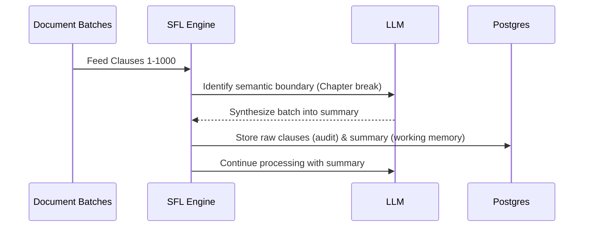
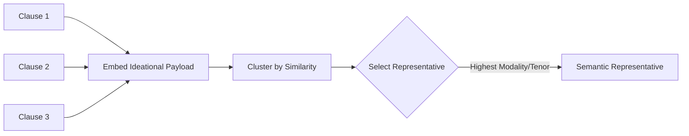

# SFL Engine — Roadmap

**Status:** Active
**Parent:** [README](README.md)

---

## Current State

Phases 0–5 of the rebuild are complete. The system is functional with a robust 2-pass pipeline and hybrid database retrieval.

```text
  [ Raw Text ] 
       |
       v
+--------------+    IPC     +---------------+
| Pass 1: Core +----------->| spaCy Sidecar | (Tokenization, Dependency Parsing)
+------+-------+            +---------------+
       |
       v
+--------------+   Prompt   +---------------+
| Pass 2: LLM  +----------->| OpenRouter /  | (Ideational & Interpersonal SFL)
+------+-------+            | Ollama Models |
       |                    +---------------+
       v
[ PgClauseStore ]
```

- Full two-pass pipeline (spaCy sidecar + LLM annotation)
- Postgres/pgvector store with hybrid retrieval
- Unified analysis engine across three source types
- CLI and HTTP API
- 655 specs passing, RuboCop clean

**What remains**: Phase 6 (hardening) and forward-looking research.

---

## Phase 6 — Hardening (≈ 3-4 days)

The final phase before the system is considered production-ready.

- **Performance Validation**: Profile the full pipeline with the bench harness (identify IPC and Postgres bottlenecks). Keep optimizations that show ≥10-20% wins.
- **Coverage Gate**: Enforce strict CI rules (specs pass, RuboCop clean, coverage meets +10% threshold).
- **YARD Documentation**: Document public API surfaces, constructor signatures, return types, and behavioral contracts.

---

## Phase 7 — Microservice API & Async Routes (Future)

Transform the SFL Engine into a high-concurrency backend service powered by Roda and Falcon, designed to serve asynchronous NLP processing tasks.

```mermaid
flowchart TD
    subgraph Client Apps
        A[Context Compiler]
        B[Other RAG Clients]
    end

    subgraph SFL API (Falcon / Roda)
        C[Async Router]
        D[Compilation Endpoints]
        E[Retrieval Endpoints]
        F[Synthesis Endpoints]
    end
    
    subgraph Workers & Sidecars
        G[spaCy Container]
        H[BERTopic Container]
    end

    A & B -->|HTTP/REST| C
    C --> D & E & F
    D -.->|IPC / Async| G
    E -.->|Query| H
```

- **Roda Routing**: Implement strict `Roda` route trees mapped to `lib/sfl/api` endpoints, separating concerns into discrete sub-apps (`/pipeline`, `/retrieve`, `/clauses`).
- **Async Execution**: Leverage Falcon's async I/O to handle long-running LLM annotation (Pass 2) and sidecar inferences without blocking the event loop.
- **Microservice Integration**: Provide unified API access points allowing external platforms (like the Syncopated Context Compiler) to offload semantic chunking and RAG workflows entirely to the `sfl-engine` container.

---

## Phase 8 — Rolling Synthesis (Research)

Implement neural memory consolidation for arbitrarily large documents.



- Process clauses in batches and synthesize at semantic boundaries.
- Preserve SFL metadata in the summary.
- Discard raw clause text from working memory to prevent truncation, keeping it in Postgres only for audit.

---

## Phase 9 — Cognitive Gas (Research)

A resource-management mechanism for LLM calls.

- **High-value clauses** (novel information, high modality) get full LLM annotation.
- **Low-value clauses** (repetitive, simple) get rule-based fallback or null annotation.
- **Graceful Degradation**: Budget exhaustion triggers switch to Pass 1 only.

```text
[ Incoming Clause ]
       |
       v
+-------------+
| Value Eval  |---> (High Value) ---> [ Full LLM Pass 2 ]
+-------------+
       |
       +----------> (Low Value) ----> [ Rule-based Fallback ]
```

---

## Phase 10 — Semantic Convergence (Research)

Detect when multiple clauses express the same semantic content in different forms.



- Cluster ideational payloads by embedding similarity.
- Select the clause with the highest interpersonal quality (modality, tenor) as the representative.
- Retrieve only representatives, reducing redundancy and increasing context window information density.

---

## Related

- [README](README.md) — project overview and current status
- [rebuild-blueprint-with-plugin.md](rebuild-blueprint-with-plugin.md) — full SIFT audit and phased backlog
- [docs/architectural-lineage.md](docs/architectural-lineage.md) — intellectual foundations
